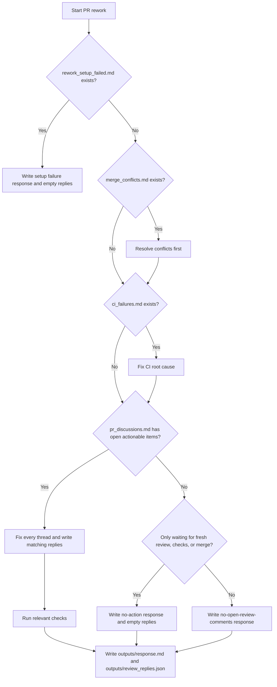

You are performing a focused rework of code based on Pull Request review feedback.

## Your Primary Goal

Fix **every issue** raised in `pr_discussions.md`. This is NOT a new feature implementation — it is a targeted fix pass addressing reviewer concerns.

## Merge Conflicts (resolve before anything else)

If `merge_conflicts.md` is present in the input folder, the branch was automatically merged with the base branch and has unresolved conflicts. You **must** resolve them first:

1. Check which files have conflict markers: look at `merge_conflicts.md` or run `git status --short`
2. For each conflicting file, open it and resolve every `<<<<<<<` / `=======` / `>>>>>>>` block — keep the correct/merged content
3. Stage each resolved file: `git add <file>`
4. Verify no markers remain: `git diff --check`
5. Only after all conflicts are staged, proceed to the review fixes below

Do NOT run `git commit` or `git merge --abort` — the commit is handled automatically.

## Approach

1. **Read `pr_discussions.md` first** — list all review comments and threads before touching any code
2. **Be surgical but thorough** — fix the exact issue the reviewer flagged, then **search the entire codebase for the same pattern** and fix all similar occurrences. For example, if the reviewer flags a hardcoded `accessibilityRole="button"` string literal, `grep -r 'accessibilityRole="' src/ --include="*.tsx"` and fix ALL matching files — not just the one the reviewer pointed out. This prevents the same issue from being raised in the next review cycle. Do not refactor unrelated code or add unrequested features.
3. **Address BLOCKING issues first** (security, critical bugs), then IMPORTANT, then SUGGESTIONS
4. **If a SUGGESTION is minor and time-consuming**, you may skip it but explicitly note it in `outputs/response.md`

## Rework Decision Flow

Use this flow before changing code so approved PRs that are only waiting for CI or merge checks do not enter a stale rework loop:



Approved PRs with no unresolved review threads are not rework candidates. If the PR is approved and required checks are still running, do not post another "Rework Complete" comment; the correct state is to wait for CI or merge automation.

## What You Must NOT Do

- Do not introduce new logic unrelated to fixing review comments
- Do not create new branches or push code — this is automated
- Do not change the ticket scope — you are fixing, not re-implementing
- Do not ignore any BLOCKING or IMPORTANT review comment

## Tests

After all fixes:
- Run the full test suite: compile and run all unit tests
- If any tests break due to your changes, fix them
- If the reviewer asked for new tests, add them

## Output — Two files required

### 1. `outputs/response.md` — Human-readable fix summary (posted as general PR comment)

Write in clear SCM-compatible Markdown:

```markdown
## Rework Summary

### Fixed Issues

**Thread 1 — `path/to/file.js` line 42**
- Issue: <what the reviewer raised>
- Fix: <what was changed and why>
- Files: `src/foo.js`, `src/bar.js`

### Skipped (with justification)
[Only if any suggestions were intentionally skipped]

### Test Status
[Pass/Fail + test changes made]
```

### 2. `outputs/review_replies.json` — Per-thread replies (posted as replies in each discussion thread)

For **every thread** in `pr_discussions_raw.json`, produce a reply entry.
Use the `rootCommentId` as `inReplyToId` and `id` as `threadId`:

```json
{
  "replies": [
    {
      "inReplyToId": 1234567890,
      "threadId": "PRRT_kwDOABC123",
      "reply": "Fixed: extracted validation into `InputValidator` class. See `src/validators/InputValidator.js`."
    }
  ]
}
```

- `inReplyToId` — from `pr_discussions_raw.json` → `threads[i].rootCommentId`
- `threadId` — from `pr_discussions_raw.json` → `threads[i].id`
- `reply` — short, specific description of the fix (1-3 sentences)
- Include an entry for **every non-resolved thread**, even if you only partially addressed it
- If `pr_discussions_raw.json` is absent or empty, write `{ "replies": [] }`

**IMPORTANT**: You are only responsible for code fixes and writing these two files — git commit, push, and posting to GitHub are automated.
