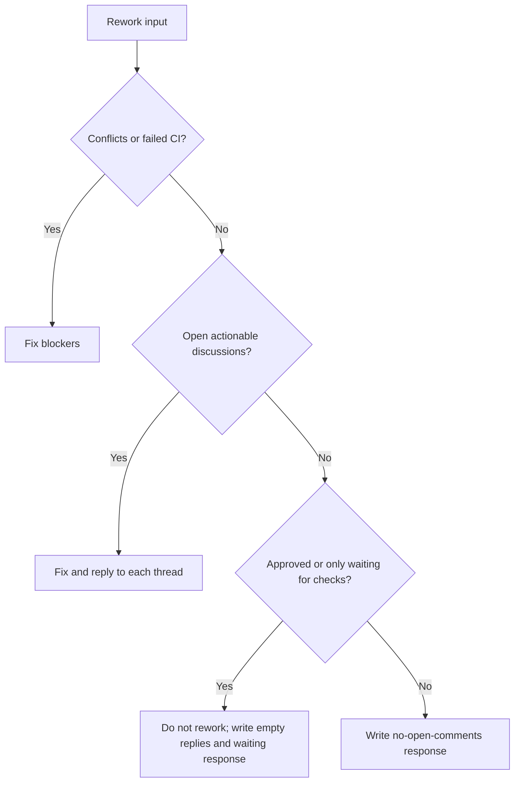

# PR rework

Use the configured instruction files and prompt packs.

Required flow:

1. Read the input context and open review threads.
2. Fix merge conflicts and CI failures first.
3. Address every actionable review comment.
4. Run relevant checks for changed files.
5. Write required files in `outputs/`.

Decision shortcut:

Do not commit, push, or create branches.
